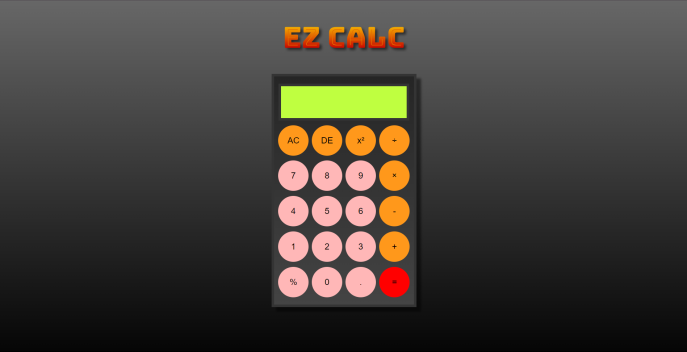

# Ez Calc

Welcome to Ez Calc! This is a simple web application based calculator  developed using HTML, CSS and JavaScript.

## Table of Contents

- [Live Website](#live-website)
- [preview](#preview)
- [Features](#features)
- [Usage](#usage)
- [Getting Started](#getting-started)
- [Built With](#built-with)
- [Contributing](#contributing)
- [License](#license)

## Live Website

- Live Preview: [Ez Calc](https://rajatthedev.github.io/ezCalc/)

## Preview

## Features

- **Basic Operations:** Addition, Subtraction, Multiplication, Division.
- **Advanced Functions:** delete last character, error handling for division by zero, Backspace functionality for easy correction.
- **User-Friendly Design:** Responsive UI with clear error messages.
- **Additional Functionality:** Size limit alert for input, Clear all with 'AC' button.

## Usage

- Simply click on the numeric buttons and operators to perform calculations.
- Utilize the additional features such as percentage, square, and backspace for more functionality.

## Getting Started

Follow these steps in order to kickstart your project:

1. Clone the Repository: `git clone git@github.com:RajatTheDev/ezCalc.git`
2. Open the `index.html` file in your preferred browser to view the content. 🌐

## Built With

- HTML
- CSS
- JavaScript

## Contributing

Contributions are welcome! If you have ideas for improvement or want to add features, please fork the repository and submit a pull request. 🚀

## License
This project is licensed under the MIT License - see the [License](LICENSE) file for details.